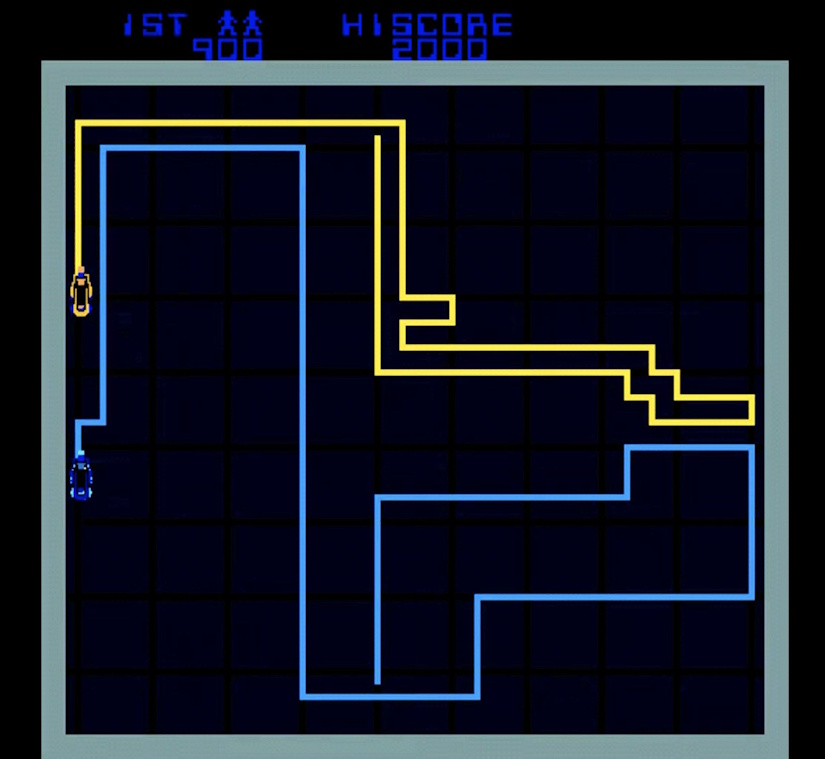
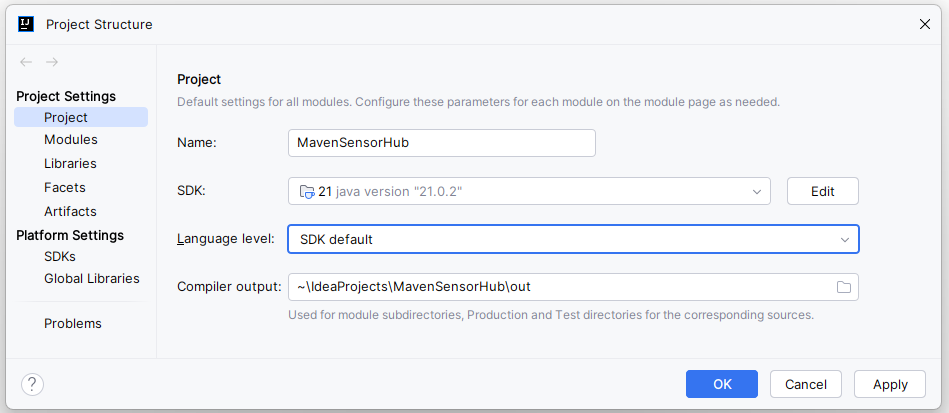
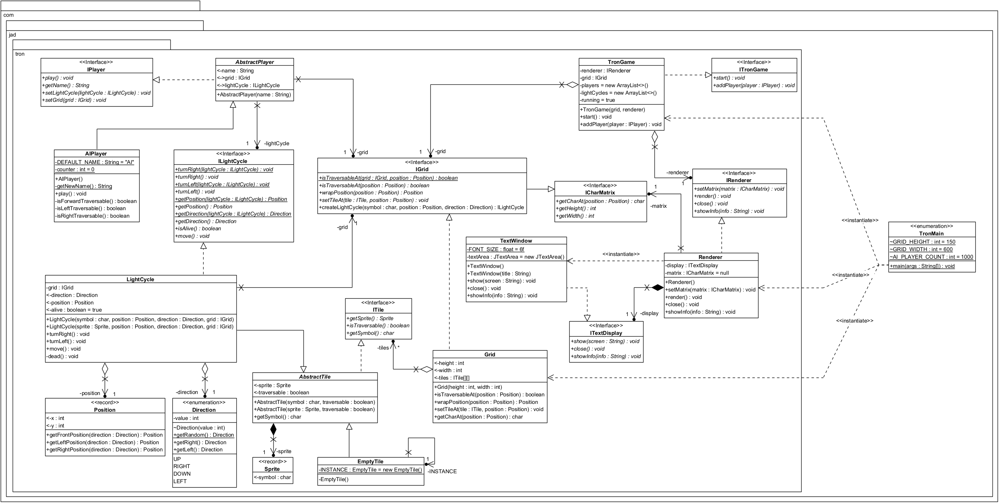
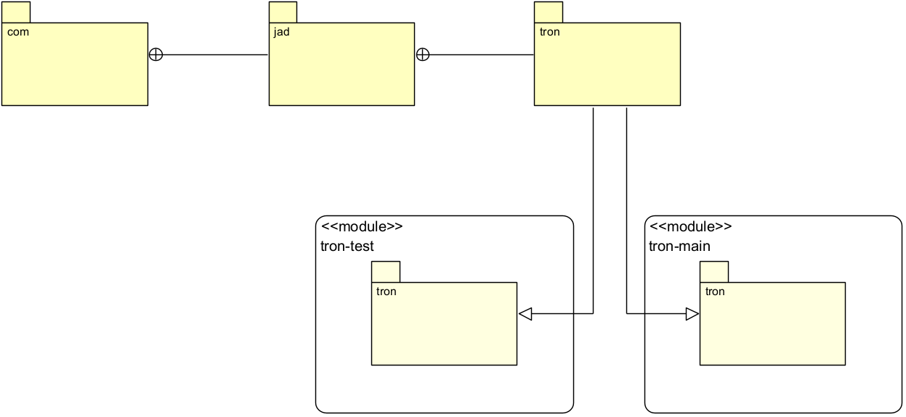
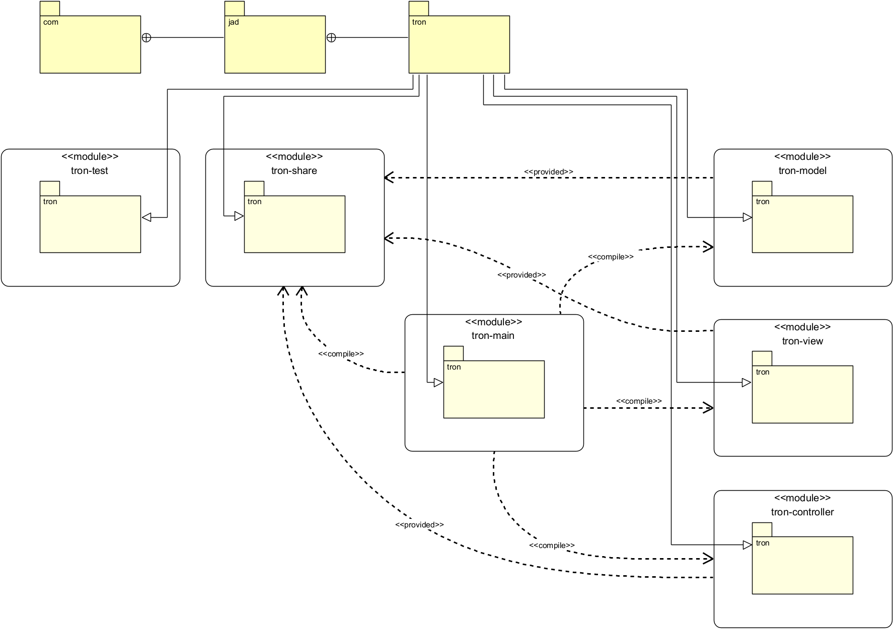

# Tron MVC

# Architecture MVC (Modèle-Vue-Contrôleur)

# Made with ❤️ by [JAD](mailto:jeanaymeric@gmail.com)

## Tron :

Le jeu Tron est un jeu vidéo d'arcade sorti en 1982.
Il a été développé par la société Midway Games et est basé sur le film Tron de 1982.
Le jeu est composé de deux joueurs qui contrôlent des light-cycles qui laissent une traînée derrière elles.
Le but du jeu est de forcer l'adversaire à entrer en collision avec une traînée, un mur ou la bordure de l'aire de jeu.

## Objectif :

Un programme a été développé pour simuler une partie de Tron entre plusieurs joueurs contrôlés par l'ordinateur.
Pour faciliter la compréhension du code, l'affichage est réalisé en mode texte.

L'applicatif est fonctionnel, étant donné que le `lombok` est utilisé, vous devez effectuer une compilation
`mvn compile` avant d'exécuter la classe `TronMain`.
Inutile d'effectuer une compilation à chaque modification de code.

Si vous souhaitez modifier la taille de la grid ou le nombre de joueurs, vous pouvez le faire dans la classe `TronMain`.
Les 3 attributs statiques `GRID_HEIGHT`, `GRID_WIDTH` et `AI_PLAYER_COUNT` peuvent être modifiés.

Vérifier que c'est le bon jdk qui est utilisé. Pour cela, allez dans le menu `File` > `Project Structure` > `Project`.
Vérifiez que le `Project SDK` est bien configuré sur le jdk 21.

Voici le **diagramme de classes** de l'application :

Voici le **diagramme de packages** de l'application (*les liens de dépendances indiquent dans leur stéréotype le
scope de la dépendance*) :

Comme vous pouvez le voir, il n'y a qu'un seul module `tron-main` qui contient toutes les classes.
Le module `tron-test` contient les classes de test. Vous n'avez pas besoin de vous en occuper ou de le modifier.
Focalisez-vous sur le module `tron-main`.

Vous devez restructurer l'application en créant plusieurs modules afin d'obtenir une architecture MVC
(Modèle-Vue-Contrôleur) classique.

Voici les modules que vous devez créer :

- `tron-main` : contient la classe `Main` qui lance l'application
- `tron-model` : contient les classes du modèle
- `tron-view` : contient les classes de la vue
- `tron-controller` : contient les classes du contrôleur
- `tron-share` : contient les classes communes aux modules
- `tron-test` : contient les classes de test

Voici le **diagramme de packages** que vous devez obtenir (*les liens de dépendances indiquent dans leur stéréotype le
scope de la dépendance à configurer dans le `pom.xml` de chaque module*) :

Heureusement pour vous, les développeurs ont créé des interfaces, des enumérations et des records. Tout n'était pas
mauvais dans
leur code.

### Aucune modification de code n'est nécessaire.

Vous ne devez pas modifier le code des classes (à part les imports bien entendu, mais votre IDE va gentiment s'en
charger pour vous).

## Validation

Des tests unitaires sont fournis pour valider votre implémentation.

À chaque `commit and push`, les tests sont exécutés automatiquement par GitHub Actions.

Certains tests passent, d'autres échouent. Naturellement, ceux qui échouent sont ceux qui rapportent des points.
Cela ne veut pas dire que les tests qui ne rapportent pas de points sont inutiles. Ils doivent, eux aussi passer quoi
qu'il arrive.

Pour visualiser les résultats des tests, cliquez sur l'onglet `Actions` de votre dépôt GitHub.
Cliquez ensuite `jad-autograding` pour voir le détail des tests.

Pour le moment, les modules n'existent pas et les dépendances entre les modules sont mauvaises. Les tests échouent donc.
